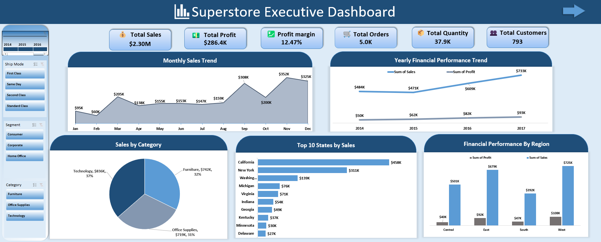
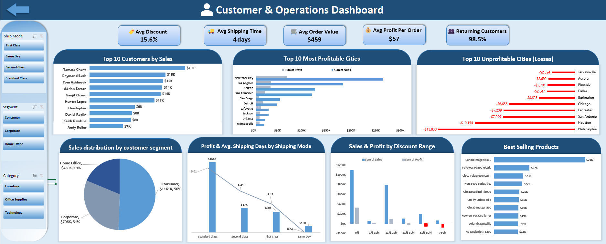
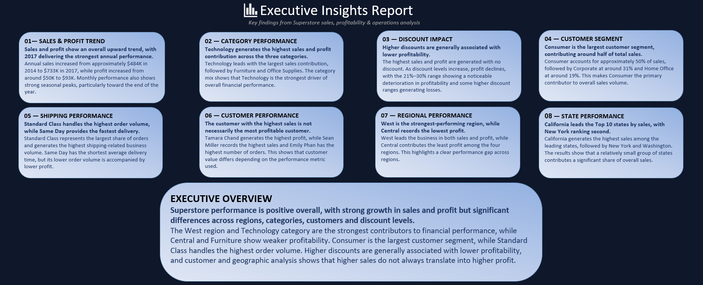

# 📊 Superstore Performance Dashboard

An interactive **Excel Business Intelligence Dashboard** built to analyze sales, profitability, customer behavior, regional performance, shipping operations, and discount impact using the Superstore dataset.

The project combines **data cleaning, data transformation, data modeling, DAX calculations, PivotTables, interactive dashboards, and business insights** into one complete analytical solution.

The final project consists of **two interactive dashboards** and a dedicated **Executive Insights Report**.

---

## 📈 Dashboards

### 1. Executive Dashboard

Provides a high-level overview of overall business performance through:

* Total Sales, Profit & Profit Margin
* Total Orders, Quantity & Customers
* Yearly Financial Performance
* Monthly Sales & Profit Trends
* Sales & Profit by Region
* Financial Performance by Category
* Top 10 States
* Regional Performance

**Interactive Filters:**

* Region
* Customer Segment
* Order Date / Timeline
* Shipping Mode

---

### 2. Customer & Operations Dashboard

Focuses on customer behavior, product performance, discounts, and shipping operations.

Includes:

* Average Discount
* Average Shipping Days
* Customer Performance
* Top 10 Customers
* Top Products
* Customer Segment Analysis
* Shipping Performance
* Discount Impact on Profitability
* Most & Least Profitable Cities
* Sales & Profit Analysis

**Interactive Filters:**

* Region
* Customer Segment
* Shipping Mode

---

### 3. Executive Insights Report

A dedicated report that summarizes the major findings discovered during the analysis.

The insights cover:

* Regional Performance
* Category & Subcategory Performance
* Discount Impact
* Customer Segment Performance
* Shipping Performance
* State & City Performance
* Customer Performance
* Sales & Profit Trends

The report ends with an overall summary of the project's most important business findings.

---

## 🧹 Data Preparation

The raw Superstore dataset was prepared before building the analytical model.

### Data Cleaning & Transformation

Using **Power Query**, the data was prepared through:

* Data type validation
* Removing duplicates
* Handling missing values
* Text cleaning and standardization
* Column transformation
* Data profiling
* Creating calculated/derived fields where required
* Preparing tables for the analytical data model

---

## ⭐ Data Modeling & Star Schema

The project was redesigned using a **Star Schema** to create a structured and scalable analytical data model.

The model consists of:

### 🟦 Fact Table

#### `FactSales`

The central transactional table containing order-line level business data.

Includes:

* Row ID
* Order ID
* Order Date Key
* Ship Date Key
* Customer Key
* Product Key
* Location Key
* Ship Mode Key
* Sales
* Quantity
* Discount
* Profit

The Fact table contains the main **numeric measures and foreign keys** used for analysis.

---

### 🟩 Dimension Tables

#### `DimCustomer`

Contains customer-related descriptive information:

* Customer ID
* Customer Name
* Segment

---

#### `DimProduct`

Contains product-related information:

* Product ID
* Product Name
* Category
* Subcategory

---

#### `DimLocation`

Contains geographic information:

* Country
* Region
* State
* City
* Postal Code

---

#### `DimShipMode`

Contains shipping method information:

* Ship Mode Key
* Ship Mode

---

#### `DimDate`

A dedicated date dimension used for time-based analysis:

* Date Key
* Date
* Year
* Quarter
* Month Number
* Month Name

---

### 🔗 Data Model Relationships

The model follows a **one-to-many relationship** structure where each dimension filters the central Fact table.

```text
                         ┌──────────────┐
                         │   DimDate    │
                         └──────┬───────┘
                                │
                                │
┌──────────────┐          ┌─────▼──────┐          ┌──────────────┐
│ DimCustomer  │─────────▶│ FactSales  │◀─────────│ DimProduct   │
└──────────────┘          └─────┬──────┘          └──────────────┘
                                │
                    ┌───────────┴───────────┐
                    │                       │
             ┌──────▼───────┐       ┌──────▼───────┐
             │ DimLocation  │       │ DimShipMode  │
             └──────────────┘       └──────────────┘
```

This structure reduces data redundancy and makes the model easier to analyze and maintain.

---

## 🛠️ Tools & Skills

### Microsoft Excel

* Power Query
* Power Pivot / Data Model
* DAX Measures
* PivotTables
* Pivot Charts
* Calculated Fields
* Slicers
* Timeline Filters
* KPI Cards
* VBA & Macros
* Interactive Navigation
* Dashboard Design
* Data Visualization

### Data Modeling

* Star Schema
* Fact Tables
* Dimension Tables
* Primary Keys
* Foreign Keys
* Surrogate Keys
* One-to-Many Relationships
* Data Model Relationships

### Data Analysis

* Exploratory Data Analysis
* KPI Analysis
* Trend Analysis
* Regional Analysis
* Customer Analysis
* Product Analysis
* Discount Analysis
* Shipping Performance Analysis

---

## 📊 Interactivity

The dashboards include interactive elements such as:

* Slicers
* Timeline Filters
* Pivot Charts
* KPI Cards
* Interactive Filtering
* Dashboard Navigation
* Navigation between dashboard pages

---

## 📁 Project Structure

```text
Superstore-Performance-Dashboard/
│
├── Superstore.xlsm
├── README.md
│
└── Images/
    ├── Executive-dashboard.png
    ├── Customers-operations-dashboard.png
    └── insights-report.png
```

---

## 📸 Dashboard Preview

### Executive Dashboard



### Customer & Operations Dashboard



### Executive Insights Report




The project combines **technical data analysis skills with business-oriented data visualization** to transform raw transactional data into an interactive reporting solution.
